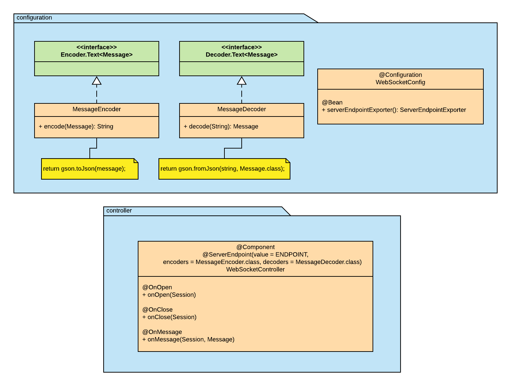

# Chat Room
Building an in-memory web-based chat room application using spring boot and JSR 356, Java API for WebSocket. 

### Tech
* Spring Boot
* Thymeleaf
* Maven
* HTML
* CSS
* JavaScript
### Dependencies
```
<dependency>
	<groupId>org.springframework.boot</groupId>
	<artifactId>spring-boot-starter-thymeleaf</artifactId>
</dependency>
<dependency>
	<groupId>org.springframework.boot</groupId>
	<artifactId>spring-boot-starter-web</artifactId>
</dependency>
<dependency>
	<groupId>org.springframework.boot</groupId>
	<artifactId>spring-boot-starter-websocket</artifactId>
</dependency>
<dependency>
	<groupId>com.google.code.gson</groupId>
	<artifactId>gson</artifactId>
	<version>2.8.6</version>
</dependency>
<dependency>
	<groupId>org.springframework.boot</groupId>
	<artifactId>spring-boot-devtools</artifactId>
	<scope>runtime</scope>
	<optional>true</optional>
</dependency>
```
### Run the application with command
```mvn clean build; mvn spring-boot:run```
### Resources
[JSR 356](https://www.oracle.com/technical-resources/articles/java/jsr356.html)
[Session](https://docs.oracle.com/javaee/7/api/javax/websocket/Session.html)
[RemoteEndpoint](https://docs.oracle.com/javaee/7/api/javax/websocket/RemoteEndpoint.Basic.html)

